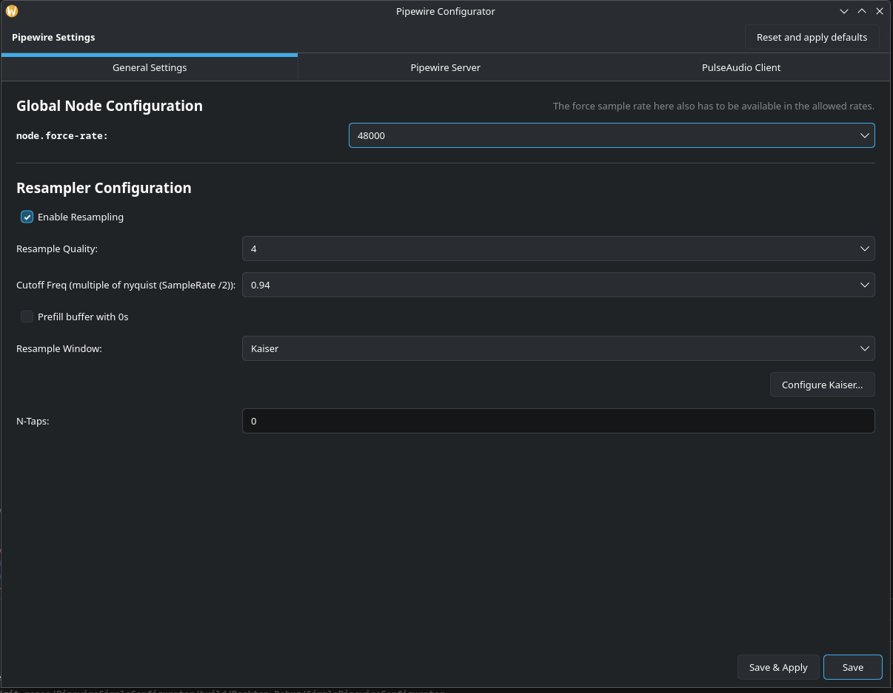
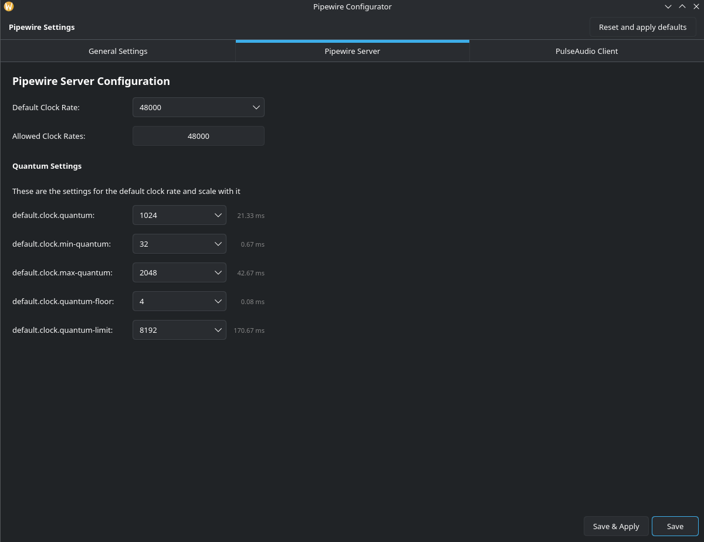
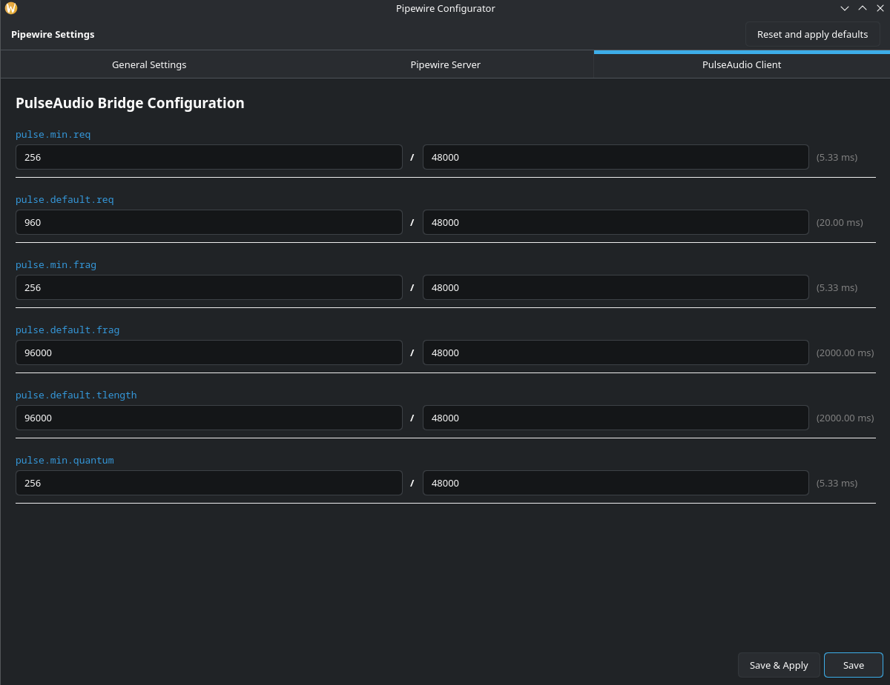

# PipewireSimpleConfigurator
This tool makes it easy to configure simple pipewire settings from a gui.


It takes the pipewire configs pipewire.conf pipewire-pulse.conf and client.conf as templates and then saved them in ~/.config/pipewire .

With apply the new settings are saved and applied and the services pipewire.service, pipewire-pulse.server, pipewire.socket and pipewire-pulse.socket are restarted.

So it may be that you have to also restart your wireplplumber.service or your pipewire-session-manager.service when the settings are not applied, but you will have to try.

This extremely simplifies configuration of the simplest pipewire files.


FYI: It applies the general settings too multiple .conf files.


# Attention
 
Before usage save your config files from ~/.config/pipewire when you have some there. Because it will override them when you hit the save or reset button. But it will also warn you.

# Build instructions

```
mkdir build && cd build
cmake ..
make -j$(nproc)
cpack
```

And then you can just install the package or use the binary directly


# Pictures






